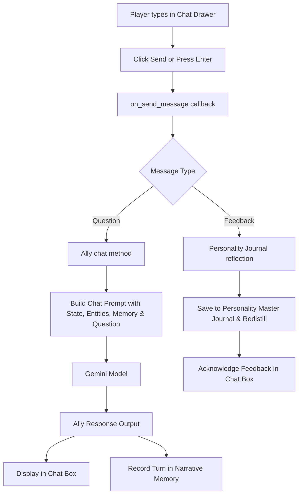

# Chat Interface Integration Plan

## Overview

Connect the Tkinter overlay chat drawer (`ChatDrawerMixin`) to the Ally agent and tiered memory/prompt system. This enables real-time Q&A ("Ask Ally") and player feedback during gameplay, allowing Ally to respond using the current game state, memory context, and personality while learning from player feedback.

---

## Architecture & Information Flow

### 1. Chat Interaction Flow (Question vs Feedback)

---

## Detailed Components & Changes

### 1. Prompt Templates ([`prompts/ally.py`](prompts/ally.py:3))

Add `ALLY_CHAT_PROMPT_TEMPLATE`:

- Receives `personality`, `genre`, `memory`, `elements`, `entities`, and `question`.
- Instructs Ally to answer the player directly in character, maintaining voice consistency.

### 2. Ally Agent Extension ([`ally/ally_agent.py`](ally/ally_agent.py:20))

Add `chat()` method to `Ally`:

- Takes game context (`elements_context`, `entities_context`, `genre_context`, `memory_context`, `personality`) and `question: str`.
- Formats `ALLY_CHAT_PROMPT_TEMPLATE` and calls `self.provider.generate_structured()`.

### 3. Main Wiring ([`main.py`](main.py:258))

Implement `on_send_message(text: str, message_type: str)` callback in [`main.py`](main.py:258):

- Spawns a background thread or asynchronous worker to call `ally.chat()` or update personality memory.
- Calls `gui_app.append_chat_message("coach", response_text)` upon completion.
- Passes `on_send_message=on_send_message` to `AllyOverlay()`.

---

## Actionable Steps

1. Add chat prompt template to [`prompts/ally.py`](prompts/ally.py:3).
2. Implement chat method in `Ally` agent ([`ally/ally_agent.py`](ally/ally_agent.py:20)).
3. Wire callback and background execution in [`main.py`](main.py:258).
4. Test and verify interactive chat loop in GUI mode.
