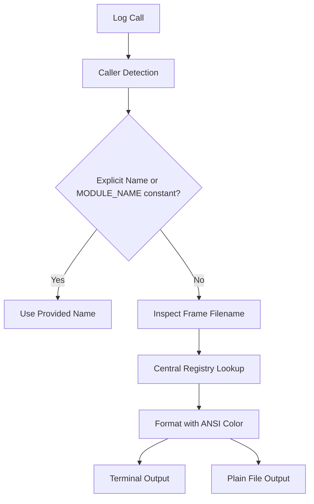

# Logging Module Implementation Plan

## Overview

Build a centralized logging module (`logging/logger.py` or similar) to replace standard `print()` statements across the Ally project. It supports printing to terminal with ANSI color codes and logging to file, with automatic caller detection and brain-analogue module naming.

## Architecture & Components

### 1. Central Registry & Color Codes (`logging/registry.py` or inside logger)

Maps file paths / module names / explicit names to Brain analogues and ANSI color codes.

### 2. Caller Detection Strategy (Zero Boilerplate)

1. **Explicit Override**: `log(message, name="SuperiorColliculus")`
2. **Caller Module Constant**: Checks `frame.f_globals.get("MODULE_NAME")` in the calling module.
3. **Filename / Path Fallback**: Inspects caller file path (e.g. `vision/change_detector.py` -> `SuperiorColliculus`) via central registry mapping.
4. **Default**: Falls back to `General` or filename module name.

### 3. Dual-Target Output

- **Terminal**: Colorized output using ANSI escape sequences (`\033[36m[SuperiorColliculus]\033[0m ...`).
- **File**: Appended to `logs/ally.log` (or configurable path) with timestamp and plain text (stripping ANSI codes or formatting cleanly).

## File Structure Changes

- Create `logging/` package:
  - `logging/__init__.py`: Exports `log`, `get_logger`, etc.
  - `logging/logger.py`: Core logging implementation, registry, formatting, and frame inspection.
- Update key modules (e.g., `main.py`, `vision/change_detector.py`, etc.) to use `from logging.logger import log` (or `from logging import log`).

## Action Steps

1. Implement `logging/logger.py` with registry, color codes, dual output, and smart caller detection.
2. Add unit tests or verification script to test logging across different caller scenarios.
3. Gradually integrate or replace print statements in key files.
