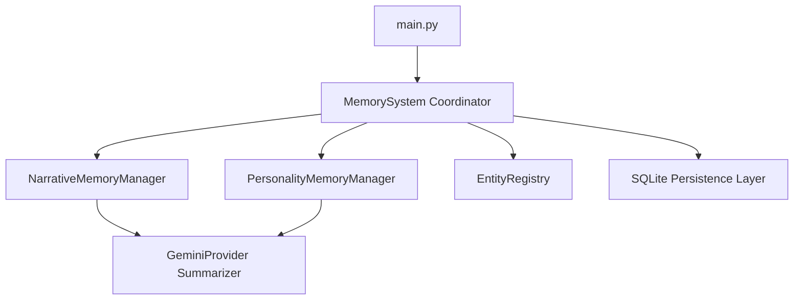
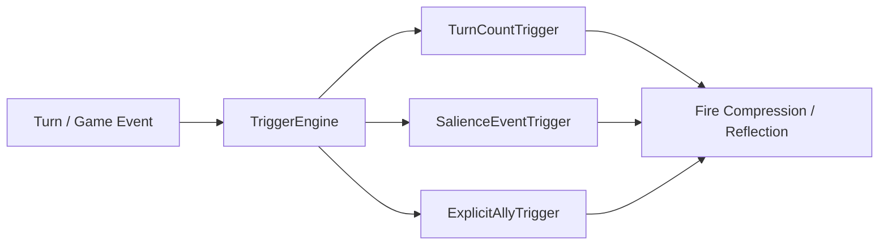

# Memory Pipeline Architecture & Implementation Plan

## 1. Architectural Design & Module Separation

To follow a clean object-oriented design and maintain clear separation of concerns, the memory system is structured around dedicated modules under the `memory/` package, coordinated by a master [`MemorySystem`](memory/manager.py:58) class.

### Module Breakdown

1. **`memory/coordinator.py` (or extending `memory/manager.py`)**:
   - Master [`MemorySystem`](memory/manager.py:58) class holding references to `NarrativeMemoryManager`, `PersonalityMemoryManager`, and `EntityRegistry`.
   - Manages SQLite connection lifecycle and cross-run/cross-session flushing.
2. **`memory/narrative.py`**:
   - Manages tiered narrative memory: Short-term rolling buffer, Medium-term situational summary, and Long-term strategic summary.
   - Handles LLM summarization compression passes between tiers.
3. **`memory/personality.py`**:
   - Manages multi-resolution personality storage: Master append-only journal, Digest (~200-400 words), and Micro prompt injection (<50 tokens).
   - Manages offline reflection/redistillation passes.
4. **`memory/triggers.py`**:
   - Defines abstract and concrete trigger evaluators for compression and reflection (e.g., turn count threshold, event/salience score, explicit battle completion flag).

---

## 2. Flexible Trigger Mechanisms

To support both time-based (turn counts) and event-based triggers (such as major narrative beats, boss fights, or Ally's decision output), we introduce a pluggable trigger evaluation system.

- **`TurnCountTrigger`**: Fires when $N$ turns have elapsed since the last flush.
- **`SalienceEventTrigger`**: Fires when an event or entity tagged with high importance (salience score) is recorded.
- **`ExplicitAllyTrigger`**: Fires when Ally explicitly requests a memory checkpoint in its structured output (e.g., after completing a major battle).

---

## 3. SQLite Persistence Schema

To ensure memories survive across runs and game sessions, SQLite will store records across three core tables:

1. `narrative_turns`: Stores short, medium, and long-term entries keyed by `player_id`, `game_id`, `save_id`, `tier`, and `timestamp`.
2. `personality_journal`: Stores Master reflection entries, Digest cache, and Micro prompt cache keyed by `player_id`.
3. `entities`: Stores non-lossy entity facts keyed by `player_id`, `game_id`, and `entity_id`.

---

## 4. Implementation Steps

1. **Database Schema & Persistence Layer (`memory/db.py`)**: Implement SQLite connection, table creation, and repository methods.
2. **Pluggable Triggers (`memory/triggers.py`)**: Implement turn-count and event-based trigger evaluation classes.
3. **Tiered Narrative Memory (`memory/narrative.py`)**: Implement short-to-medium and medium-to-long LLM compression passes driven by trigger evaluations.
4. **Multi-Resolution Personality (`memory/personality.py`)**: Implement Master journal append, Digest regeneration, and Micro prompt caching.
5. **Master Coordination (`memory/coordinator.py`)**: Wire sub-managers together into a unified [`MemorySystem`](memory/manager.py:58) class and integrate into [`main.py`](main.py:1).
