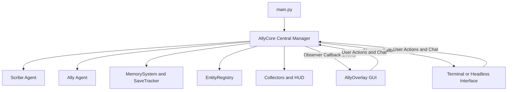

# Plan: Decoupling Central Manager from GUI

## 1. Overview & Objectives

Currently, application orchestration logic, state sharing (`state = {"memory_manager": None, "registry": None}`), thread coordination, chat message routing, and event handling are tightly coupled between `main.py` and the Tkinter GUI overlay (`gui/tkinter_app.py`). 

The goal of this refactoring is to introduce a GUI-agnostic central manager (`AllyCore` or `AllyManager`) that encapsulates all agent pipelines, memory systems, entity registries, state sandboxes, and execution loops. This makes the core logic completely independent of Tkinter, enabling it to run headlessly in the terminal or support alternative frontend implementations.

---

## 2. Architecture Design

### 2.1 Core Manager (`AllyCore`)

`AllyCore` will live in a new module (e.g., `ally/core.py` or `ally/manager.py`) and manage:
- **Initialization**: Sets up Gemini provider, Scribe, Ally, StateSandbox, GenreTracker, MemorySystem, EntityRegistry, SaveTracker, and Collectors.
- **Execution Loops**: Implements `run_turn()` and `run_loop()` cleanly.
- **Interaction Handlers**: Processes player chat questions, feedback reflections, and run-boundary closures.
- **Observer / Event Hook Pattern**: Exposes callback hooks (e.g., `on_feedback`, `on_chat_message`, `on_state_summary`, `on_prompt_update`, `on_pipeline_image`, `on_eta_update`, `on_token_update`, `on_status_update`, `on_connection_status`) so any frontend can register observers without the core importing or knowing about GUI frameworks.

### 2.2 Presentation Layer (`AllyOverlay`)

- `AllyOverlay` becomes a pure presentation layer (View).
- It registers callbacks with `AllyCore` to receive UI updates.
- It forwards user actions (like clicking Send in the chat drawer or opening Settings) to `AllyCore`.

### 2.3 Terminal / Headless Support

- With `AllyCore` handling the business logic, a terminal runner can instantiate `AllyCore`, register terminal printing callbacks, and run turns or chat interactively in the CLI.

---

## 3. Architecture Diagram

---

## 4. Actionable Steps & Implementation Phases

1. **Phase 1: Design & Create `AllyCore` (`ally/core.py`)**
   - Extract state management, turn execution, run loops, and chat handling from `main.py`.
   - Implement event hook / observer pattern for UI updates.
2. **Phase 2: Decouple GUI (`gui/tkinter_app.py`)**
   - Refactor `AllyOverlay` to accept an `AllyCore` instance or delegate event callbacks to `AllyCore`.
3. **Phase 3: Streamline `main.py`**
   - Simplify `main.py` to initialize `AllyCore`, wire up either the GUI or terminal runner, and execute.
4. **Phase 4: Testing & Verification**
   - Create unit/integration tests ensuring `AllyCore` functions correctly in headless/terminal mode without importing Tkinter.
