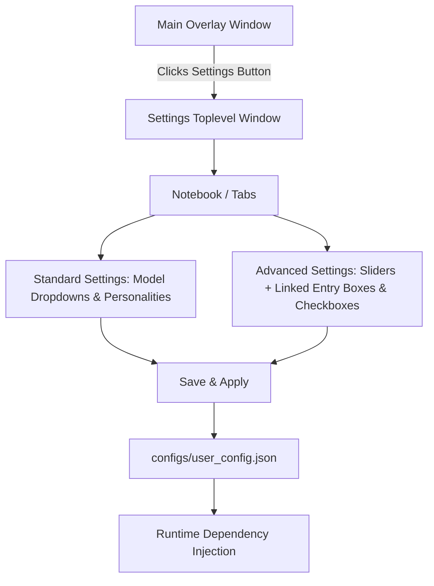

# Comprehensive Settings & Configuration Architecture Plan

## 1. Identified Locations of Hardcoded Models

The following files across the codebase contain hardcoded LLM model identifiers:

1. **[`memory/narrative.py`](memory/narrative.py)**
   - Line 92: `model="gemini-3.5-flash-lite"` in `_flush_to_medium_term()`
   - Line 111: `model="gemini-3.5-flash-lite"` in `flush_to_long_term()`

2. **[`memory/personality.py`](memory/personality.py)**
   - Line 60: `model="gemini-3.5-flash-lite"` in `redistill()` (digest generation)
   - Line 71: `model="gemini-3.5-flash-lite"` in `redistill()` (micro generation)

3. **[`interpretation/scribe.py`](interpretation/scribe.py)**
   - Line 15: `SCRIBE_MODEL = "gemini-3.5-flash-lite"`
   - Line 24: `model=SCRIBE_MODEL` in `extract()`

4. **[`ally/ally_agent.py`](ally/ally_agent.py)**
   - Line 18: `ALLY_MODEL = "gemini-3.5-flash-lite"`
   - Line 41: `model=ALLY_MODEL` in `decide()`

5. **[`ally/geneology.py`](ally/geneology.py)**
   - Line 61: `model: str = "gemini-3.5-flash"` parameter default in `Geneology.__init__()`
   - Line 115: `model=self.model` in `_build_subtree()`

---

## 2. Configuration Strategy: Global User Config vs. Per-Game Config

### Separation of Concerns
- **Per-Game Config (`configs/<game_id>/config.json`)**:
  - Contains parameters specific to capturing and running a particular game (`game_id`, `window_title`, `layout_dir`, `source_tag`).
- **Global User Config (`configs/user_config.json`)**:
  - Contains user preferences, model selections, and tunable thresholds across all agents and vision pipelines.

---

## 3. Parameter Enumeration & Tiering (Standard vs. Advanced/Dev)

### Tier 1: Standard Settings (User-Friendly / General)
- **LLM Models** (Dropdown selectors):
  - Scribe Model (`scribe_model`, choices: `gemini-3.5-flash-lite`, `gemini-3.5-flash`, `gemini-2.5-flash`, etc.)
  - Ally Model (`ally_model`, choices: `gemini-3.5-flash-lite`, `gemini-3.5-flash`, `gemini-2.5-flash`, etc.)
  - Narrative Model (`narrative_model`, choices: `gemini-3.5-flash-lite`, `gemini-3.5-flash`)
  - Personality Model (`personality_model`, choices: `gemini-3.5-flash-lite`, `gemini-3.5-flash`)
  - Genealogy Model (`geneology_model`, choices: `gemini-3.5-flash`, `gemini-2.5-flash`)
- **Companion / Personality** (Dropdown selector):
  - Default Personality (`default_personality`, choices from `PERSONALITIES` dict: `Scout`, `Sage`, `Min-Maxer`, etc.)

### Tier 2: Advanced / Dev Settings (Fine-Tuning & Thresholds)
- **Vision & Change Detection ([`vision/change_detector.py`](vision/change_detector.py))**:
  - Change threshold percent (`threshold_percent`, slider + entry box: `0.1` to `50.0`, default: `5.0`)
  - Pixel diff threshold (`pixel_diff_threshold`, slider + entry box: `1` to `255`, default: `30`)
  - Major change threshold (`major_change_threshold`, slider + entry box: `1.0` to `100.0`, default: `20.0`)
  - Cooldown seconds (`cooldown_seconds`, slider + entry box: `0.1` to `10.0`, default: `1.0`)
  - Stability threshold percent (`stability_threshold_percent`, slider + entry box: `0.1` to `20.0`, default: `5.0`)
  - Booleans (Checkboxes): `enable_cooldown`, `enable_stability_check`, `use_ssim`.
- **Screen Classification ([`vision/screen_classifier.py`](vision/screen_classifier.py))**:
  - Match threshold (`match_threshold`, slider + entry box: `0.5` to `1.0`, default: `0.85`)
  - Draft match threshold (`draft_match_threshold`, slider + entry box: `0.5` to `1.0`, default: `0.93`)
- **Screen Bootstrapper ([`vision/screen_bootstrapper.py`](vision/screen_bootstrapper.py))**:
  - Unknown streak threshold (`unknown_streak_threshold`, spinbox/entry: `1` to `10`, default: `3`)
- **Memory & Triggers ([`memory/narrative.py`](memory/narrative.py))**:
  - Short-term buffer capacity (`short_term_capacity`, spinbox/entry: `2` to `30`, default: `8`)

---

## 4. Settings Menu UI Architecture & Controls

### UI Component Guidelines
- **Separate Toplevel Window**: Launched via a dedicated settings button on the main overlay/drawer.
- **Synced Sliders and Input Boxes**: For numeric/float tuning parameters (e.g., thresholds), sliding updates the entry box text and editing the entry box updates the slider position in real time.
- **Dropdowns (`ttk.Combobox`)**: Used for discrete choices like LLM model names and personality archetypes.
- **Checkboxes (`tk.Checkbutton`)**: Used for boolean flags (e.g. SSIM toggle, cooldown toggles).
- **Tabbed Layout (`ttk.Notebook`)**: Separates Standard vs. Advanced settings to keep the UI clean and approachable.
