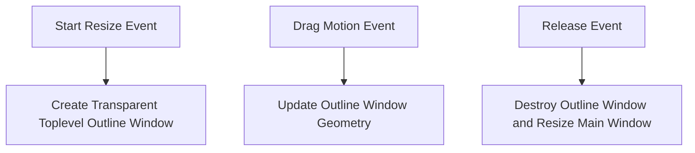

# Resize Outline Plan

Plan for adding a semi-transparent green outline overlay window during resizing of [`gui/tkinter_app.py`](gui/tkinter_app.py:30).

## Architecture & Workflow

## Implementation Details

1. **[`gui/tkinter_app.py`](gui/tkinter_app.py:447)** (`_start_resize`):
   - Instantiate a transparent `tk.Toplevel` window (`self._resize_outline_win`).
   - Set attributes: `overrideredirect(True)`, `attributes('-topmost', True)`, `attributes('-alpha', 0.3)`.
   - Set background or canvas border to a semi-transparent green color (e.g. `cfg.success_color` or vibrant green).
   - Position and size it to match the current window geometry (`self.winfo_x()`, `self.winfo_y()`, `self.winfo_width()`, `self.winfo_height()`).

2. **[`gui/tkinter_app.py`](gui/tkinter_app.py:455)** (`_do_resize`):
   - As the user drags the resize grip, update `self._resize_outline_win` geometry to `f"{self._current_new_w}x{self._current_new_h}+{self.winfo_x()}+{self.winfo_y()}"`.

3. **[`gui/tkinter_app.py`](gui/tkinter_app.py:463)** (`_stop_resize`):
   - Destroy `self._resize_outline_win`.
   - Apply the finalized width and height to `self.geometry(...)`.
