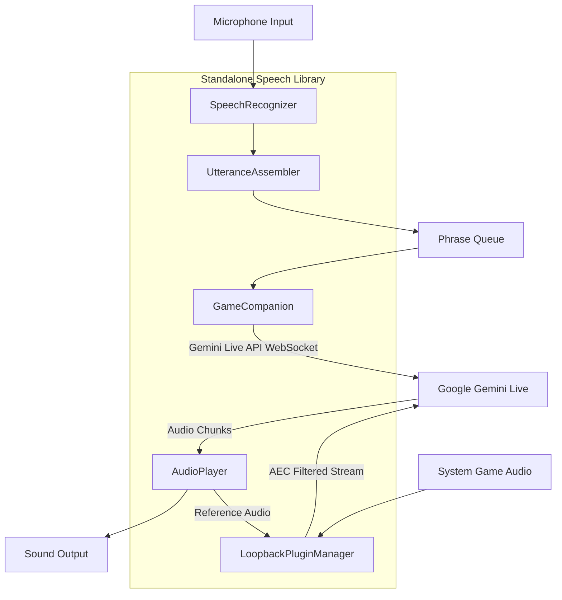

# Speech Module Extraction & Refactoring Plan

This document outlines the architectural design, code review findings, public API surface definition, example usage, and step-by-step extraction plan for breaking off the `tooling/goodies/speech` module into an independent, standalone Python library package (`gemini-live-speech`).

---

## 1. Public API Endpoints & Library Surface

The library exposes a clean, modular API via its top-level package (`__init__.py`):

1. **`GameCompanion`** (`companion.py`)
   - **Purpose**: Owns the Gemini Live API session, manages WebSocket connection, sends player text turns, and streams back model audio/text responses.
   - **Constructor**: `GameCompanion(client: genai.Client, player: AudioPlayer, model_id: str = MODEL_ID, loopback_plugin: Optional[LoopbackPluginManager] = None)`
   - **Methods**: `run(phrase_queue: asyncio.Queue[str], player_turn: asyncio.Event)`
2. **`SpeechRecognizer`** (`recognizer.py`)
   - **Purpose**: Wraps local offline Vosk speech recognition and sounddevice microphone stream.
   - **Constructor**: `SpeechRecognizer(model_path: str = VOSK_MODEL_PATH, samplerate: int = MIC_SAMPLE_RATE)`
   - **Methods**: `__enter__`, `__exit__`, `poll() -> Optional[str]`, `reset()`, `level() -> float`
3. **`AudioPlayer`** (`player.py`)
   - **Purpose**: Gapless, callback-driven PCM audio playback via persistent `sounddevice.OutputStream`.
   - **Constructor**: `AudioPlayer(samplerate: int = TTS_SAMPLE_RATE, prebuffer_ms: int = 150, latency: str = "high", reference_callback: Optional[Callable] = None)`
   - **Methods**: `enqueue(audio_array)`, `is_playing()`, `buffered_seconds()`, `poll_reference()`, `close()`
4. **`UtteranceAssembler`** (`assembler.py`)
   - **Purpose**: Buffers Vosk finalized fragments across thinking pauses using `THINKING_PAUSE_SECONDS`.
   - **Constructor**: `UtteranceAssembler(pause_seconds: float = THINKING_PAUSE_SECONDS)`
   - **Methods**: `add_fragment(fragment)`, `has_pending()`, `ready()`, `flush() -> str`
5. **`LoopbackPluginManager`** (`plugins/loopback/plugin.py`)
   - **Purpose**: WASAPI/CoreAudio/ALSA system audio loopback capture, resampling, downmixing, echo cancellation filtering (`EchoCancellationFilter`), and streaming to Gemini Live.
   - **Constructor**: `LoopbackPluginManager(target_sample_rate: int = 16000)`
   - **Methods**: `start()`, `stop()`, `level()`, `get_reference_callback()`, `stream_loop(session, player)`
6. **Orchestrator Functions** (`orchestrator.py`)
   - `dual_input_meter_loop(...)`: Coordinates ASCII mic & audio meters, speech recognition polling, utterance assembly, and queue dispatch.
   - `run_with_reconnect(...)`: Handles automatic WebSocket reconnection with exponential backoff / delay.

---

## 2. Third-Party Example Usage

Here is how a third-party developer uses the library in an async Python application:

```python
import os
import asyncio
from google import genai
from gemini_speech import (
    GameCompanion,
    AudioPlayer,
    SpeechRecognizer,
    run_with_reconnect,
    dual_input_meter_loop,
)

async def main() -> None:
    # 1. Initialize Gemini client
    client = genai.Client(api_key=os.environ.get("GEMINI_API_KEY"))
    
    # 2. Setup audio player and companion
    player = AudioPlayer()
    phrase_queue: asyncio.Queue[str] = asyncio.Queue()
    player_turn = asyncio.Event()
    
    companion = GameCompanion(client=client, player=player)

    # 3. Start speech recognition and orchestration loops
    with SpeechRecognizer() as recognizer:
        meter_task = asyncio.create_task(
            dual_input_meter_loop(recognizer, None, phrase_queue, player_turn)
        )
        try:
            await run_with_reconnect(companion, phrase_queue, player_turn)
        finally:
            meter_task.cancel()
            await asyncio.gather(meter_task, return_exceptions=True)
            player.close()

if __name__ == "__main__":
    asyncio.run(main())
```

---

## 3. System Architecture & Data Flow Diagram



---

## 4. Code Review & Refactoring Pass

1. **Consolidation of Duplicate Code**: Eliminate legacy monolithic `speech.py` and rely on modular package structure.
2. **Configuration Extensibility**: Allow overriding config defaults (`config.py`) via constructor arguments or environment variables.
3. **Error Handling & Logging**: Replace raw `sys.exit(1)` and `print()` calls with proper logging and exceptions (`ModelNotFoundError`, `AuthenticationError`).
4. **Type Hinting & Docstrings**: Ensure complete docstrings and type annotations across all public classes and functions.

---

## 5. Step-by-Step Extraction Plan

1. **Repository Setup**: Initialize standalone project repository with `pyproject.toml`, `README.md`, `LICENSE`, and `src/` layout.
2. **Module Migration**: Copy modular files and plugins into the package structure.
3. **Refactoring & Exception Handling**: Decouple error paths for clean third-party consumption.
4. **Testing & Validation**: Add unit tests for utterance assembly, polishing, and audio buffering.
